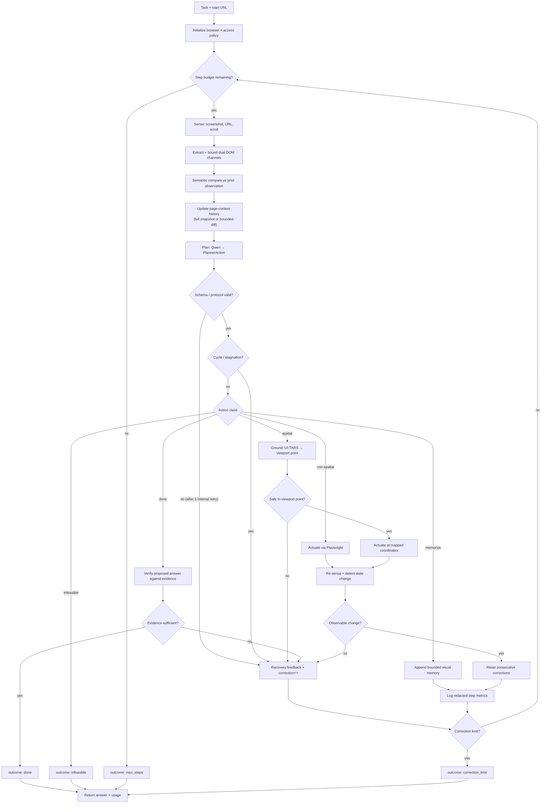
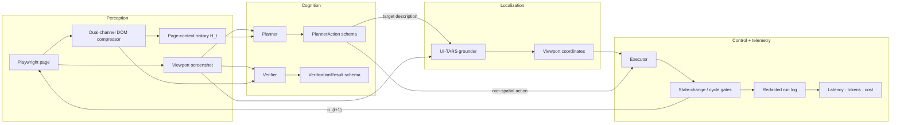

# Sherpa Architecture

## Abstract

Sherpa is a closed-loop web agent that couples multimodal planning with screenshot-only visual
grounding. At each step the planner consumes a viewport image plus two bounded semantic channels
(visible controls and cleaned main-content Markdown), selects one atomic action, and—when the
action is spatially grounded—delegates localization to a separate grounder that never sees DOM
coordinates or element identifiers. Actuation is performed by Playwright. Termination (`done`) is
gated by an independent evidence verifier rather than by planner self-report alone.

Default models: Qwen3.5-35B-A3B (planner / verifier) and UI-TARS-1.5-7B (grounder). Both are
configurable. The control loop is finite: at most \(S\) planner iterations and \(C\) consecutive
corrections (defaults \(S=20\), \(C=5\)).

## Design thesis

Browser agents fail in two complementary ways: (1) plans that ignore what is actually visible, and
(2) localization that shortcuts vision via DOM handles. Sherpa separates those concerns:

| Role | Input | Output | Constraint |
| --- | --- | --- | --- |
| Planner | Screenshot + compact page context + progress + memories + feedback | Typed `PlannerAction` | Schema-validated JSON |
| Grounder | Screenshot + natural-language target description | In-viewport point | No DOM IDs or precomputed boxes |
| Executor | Action (+ optional point) | Page mutation | Playwright only |
| Verifier | Proposed answer + current evidence bundle | Accept / reject (+ missing evidence) | Same planner model family |

The grounder is intentionally information-poor relative to the planner: semantic structure informs
*what* to do; pixels alone determine *where*.

## Control loop

## Observation model

Each observation \(o_t\) comprises:

1. **Viewport screenshot** — authoritative for layout and visibility.
2. **Controls channel** — visible interactive elements, bounded (default ≤ 4k characters).
3. **Content channel** — cleaned main-content Markdown, bounded (default ≤ 8k characters).
4. **Metadata** — URL and scroll position.

Channels are redacted, fingerprinted, and concatenated into a compact page-context record. History
\(H_t\) is maintained as:

- a full dual-channel snapshot on first visit or extraction failure;
- a bounded semantic diff (default ≤ 3k characters) when the page changes meaningfully;
- no new entry when fingerprints indicate an unchanged page.

Because planner calls are stateless, every plan request replays \(H_t\) in full (initial snapshot
followed by subsequent diffs). Unchanged steps therefore do not inflate context with duplicates.

Progress state is similarly bounded: an eight-entry progress ledger, up to eight memorized visual
facts, and up to two milestone screenshots retained for verification.

## Decision, grounding, and actuation

**Planning.** The planner emits exactly one atomic action from a closed vocabulary (`click`,
`type`, `select`, `scroll`, `scroll_home`, `scroll_end`, `go_back`, `memorize`, `press_enter`,
`done`, `infeasible`). Spatial actions carry a unique visible-element description for the grounder;
non-spatial actions execute without grounding.

**Protocol recovery.** Malformed or truncated planner/verifier JSON triggers one internal protocol
retry with error feedback. That retry does not consume an agent step or correction credit.

**Grounding.** UI-TARS receives only the current screenshot and the planner’s target description,
returning a point that is mapped from the model’s image space into viewport coordinates. Failure to
produce a safe in-viewport point is treated as a recoverable error.

**Actuation.** Playwright applies the action, then the agent re-observes. Absence of URL, scroll,
screenshot, or semantic change yields no-state-change feedback. Structural stalls (repeated
action cycles, search-scroll stagnation without query change) inject recovery pressure before the
correction budget is exhausted.

**Verification.** A `done` proposal is accepted only if the verifier judges that current evidence
visibly supports every requested condition. Weak answers may be rejected with explicit
`missing_evidence` before or after the model verifier (e.g., under-specified enumerations).

## Module boundaries

| Module | Responsibility |
| --- | --- |
| `browser` | Navigation, dual-channel extraction, settle waits, HTTP access policy, action execution |
| `models` | Planner / grounder / verifier prompts, schema parsing, protocol retry, usage accounting |
| `agent` | Closed loop: sense → plan → (ground) → act → verify / recover |
| `coordinates` | Image-space → viewport mapping |
| `runlog` | Redacted JSONL step records |
| `webvoyager` / `eval` | Benchmark harness and offline scoring |

## Invariants

1. **Vision monopoly on localization.** The grounder never receives DOM coordinates or internal
   element identifiers; localization remains screenshot-conditioned.
2. **Lossless history replay under change.** Planner context replays the initial compact snapshot
   and every subsequent semantic diff; unchanged observations do not append duplicates.
3. **Schema closure.** Planner and verifier outputs are schema-constrained; one internal protocol
   retry is allowed without advancing the step or correction counters.
4. **Log hygiene.** Raw page text and form values are excluded from run logs. Retained fields are
   bounded metrics, fingerprints, outcomes, model usage, and error categories.
5. **Finite horizon.** The loop terminates on verified `done`, `infeasible`, exhausted step budget,
   or exhausted consecutive-correction budget.
6. **Access policy.** WebVoyager defaults to unrestricted HTTP (all methods). `--read-only`
   restricts to GET / HEAD / OPTIONS; blocked writes surface as recovery feedback when that mode is
   active.
